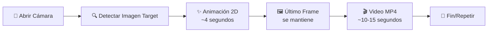
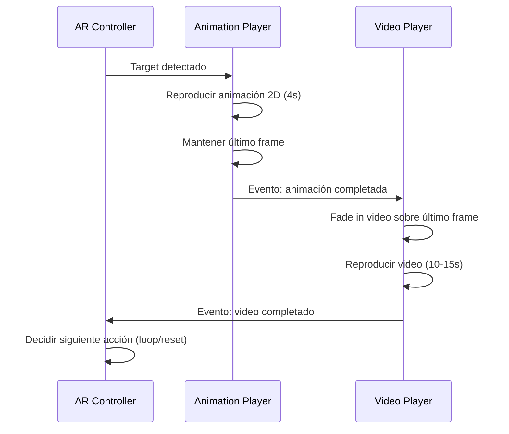
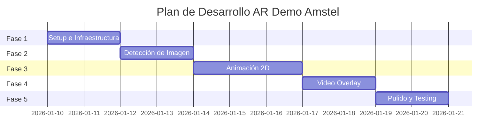

# Plan de Desarrollo: Demo AR Web para Amstel

## Resumen Ejecutivo

**Proyecto:** Demo de Realidad Aumentada basada en tecnologías web  
**Cliente:** Amstel  
**Objetivo:** Crear una experiencia AR que detecte una imagen target, reproduzca una animación 2D con transparencia (~4 segundos), y luego muestre un video superpuesto (~10-15 segundos)

### Flujo de la Experiencia AR



---

## Stack Tecnológico (según propuesta)

| Componente | Tecnología | Justificación |
|------------|------------|---------------|
| Image Tracking | **MindAR.js** | Detección y seguimiento de imagen target |
| Renderizado | **Three.js** (mínimo) | Necesario para anclar contenido al tracking |
| Animación 2D | **Lottie** (recomendado) o **Sprites** | Lottie es vectorial, ligero y escalable; Sprites como fallback |
| Video Final | **HTML5 Video API** | Reproducción nativa de MP4, amplia compatibilidad |
| UI/UX | **HTML5 + CSS3 + JavaScript** | Compatibilidad móvil universal |

> [!IMPORTANT]
> **¿Por qué Three.js si el contenido es 2D?**
> 
> MindAR proporciona datos de tracking (posición/rotación de la imagen detectada), pero
> para que el contenido **siga visualmente** al target, necesitamos Three.js para:
> 1. Crear un plano donde se renderiza el contenido 2D
> 2. Aplicar automáticamente la matriz de transformación del tracking
> 
> Sin Three.js, el contenido no seguiría el movimiento de la imagen.

---

## Fase 1: Setup del Proyecto e Infraestructura

### Objetivos
- Configurar el entorno de desarrollo
- Crear estructura base del proyecto con MindAR.js + Three.js
- Configurar servidor HTTPS local (requerido para cámara)
- Validar compatibilidad con dispositivos móviles

### Desarrollo

#### 1.1 Estructura del Proyecto
```
demo-amstel/
├── index.html              # Punto de entrada principal
├── assets/
│   ├── markers/            # Imágenes target para detección
│   │   └── target.jpg      # Imagen que se detectará
│   │   └── target.mind     # Archivo compilado para MindAR
│   ├── animations/         # Animaciones Lottie o sprites
│   │   └── intro.json      # Animación Lottie (recomendado)
│   ├── videos/             # Videos del proyecto
│   │   └── amstel_video.mp4
│   └── images/             # Otros assets
├── css/
│   └── styles.css          # Estilos globales
├── js/
│   ├── app.js              # Lógica principal
│   ├── ar-controller.js    # Control de AR (MindAR + Three.js)
│   ├── animation-player.js # Reproductor de animación 2D (Lottie)
│   └── video-player.js     # Control de video overlay
├── lib/                    # Librerías externas (si no se usa CDN)
└── README.md               # Documentación
```

#### 1.2 Dependencias del Proyecto
```json
{
  "dependencies": {
    "mind-ar": "^1.2.0",       // Image tracking
    "three": "^0.150.0",       // Renderizado (requerido por MindAR)
    "lottie-web": "^5.12.0"    // Animaciones 2D
  }
}
```

#### 1.3 Configuración Inicial
- Servidor local con HTTPS (requerido para acceso a cámara)
- Configuración de viewport para móviles
- Meta tags para PWA compatibility

### Entregables
- [ ] Repositorio inicializado con estructura de carpetas
- [ ] `index.html` base con configuración móvil
- [ ] Dependencias instaladas (MindAR, Three.js, Lottie)
- [ ] Servidor de desarrollo HTTPS configurado (puede usar `npx serve` o ngrok)

### Tests
- [ ] **Test de Cámara:** Verificar que la cámara se abre correctamente en iOS Safari y Android Chrome
- [ ] **Test HTTPS:** Confirmar que el servidor local tiene certificado válido o se usa ngrok/similar
- [ ] **Test Responsive:** La interfaz se adapta a diferentes tamaños de pantalla
- [ ] **Test de Permisos:** Los permisos de cámara se solicitan correctamente

---

## Fase 2: Detección de Imagen Target

### Objetivos
- Implementar detección de imagen en tiempo real
- Crear/configurar la imagen target optimizada
- Asegurar tracking estable y preciso

### Desarrollo

#### 2.1 Preparación de Imagen Target
```javascript
// Especificaciones recomendadas para imagen target:
// - Resolución mínima: 640x480px
// - Alto contraste y patrones únicos
// - Sin texto pequeño o patrones repetitivos
// - Formato: JPG o PNG
```

#### 2.2 Implementación con MindAR.js (Recomendado)
```javascript
// Ejemplo de estructura básica
import { MindARThree } from 'mind-ar/dist/mindar-image-three.prod.js';

const mindarThree = new MindARThree({
  container: document.querySelector('#ar-container'),
  imageTargetSrc: './assets/markers/target.mind',
});

const { renderer, scene, camera } = mindarThree;
const anchor = mindarThree.addAnchor(0);

// Event listeners
anchor.onTargetFound = () => {
  console.log("Target detectado - iniciar animación");
  startAnimation();
};

anchor.onTargetLost = () => {
  console.log("Target perdido");
};
```

#### 2.3 Compilación de Target
- Usar herramienta de MindAR para generar archivo `.mind`
- Optimizar imagen para mejor detección

### Entregables
- [ ] Imagen target preparada y optimizada
- [ ] Archivo `.mind` compilado para MindAR
- [ ] `ar-controller.js` con lógica de detección
- [ ] Interfaz que muestra feedback visual cuando se detecta el target

### Tests
- [ ] **Test de Detección:** La imagen se detecta al enfocar con la cámara
- [ ] **Test de Distancia:** Detecta a diferentes distancias (cerca, media, lejos)
- [ ] **Test de Ángulos:** Detecta en ángulos de hasta 45°
- [ ] **Test de Iluminación:** Funciona en condiciones de luz variadas
- [ ] **Test de Pérdida:** Maneja correctamente cuando el target sale del frame
- [ ] **Test de Re-detección:** Vuelve a detectar si el target reaparece

---

## Fase 3: Sistema de Animación 2D con Transparencia

### Objetivos
- Implementar reproductor de animación Lottie (opción principal)
- Alternativa: sistema de sprites para mayor compatibilidad
- Asegurar transparencia correcta (alpha channel)
- Sincronizar con la detección de imagen
- Mantener el último frame después de la animación

### Desarrollo

#### 3.1 Opción A: Lottie (Recomendada)

**Ventajas de Lottie:**
- ✅ Archivos JSON ultra ligeros (vs MB de PNGs)
- ✅ Vectorial = escalable sin pérdida de calidad
- ✅ Transparencia nativa
- ✅ Control programático completo
- ✅ Fácil exportación desde After Effects

```javascript
// animation-player.js usando Lottie
import lottie from 'lottie-web';

class LottieAnimationPlayer {
  constructor(container, options) {
    this.animation = null;
    this.container = container;
    this.onComplete = options.onComplete || null;
  }

  load(animationPath) {
    this.animation = lottie.loadAnimation({
      container: this.container,
      renderer: 'svg', // o 'canvas' para mejor rendimiento
      loop: false,
      autoplay: false,
      path: animationPath // archivo .json de Lottie
    });

    this.animation.addEventListener('complete', () => {
      this.holdLastFrame();
      if (this.onComplete) this.onComplete();
    });
  }

  play() {
    this.animation.play();
  }

  holdLastFrame() {
    // Lottie automáticamente mantiene el último frame cuando loop=false
    this.animation.goToAndStop(this.animation.totalFrames - 1, true);
  }

  destroy() {
    this.animation.destroy();
  }
}
```

#### 3.2 Opción B: Sprites (Fallback)

```javascript
// sprite-animation-player.js
class SpriteAnimationPlayer {
  constructor(options) {
    this.frames = [];           // Array de URLs de frames
    this.currentFrame = 0;
    this.fps = options.fps || 24;
    this.loop = options.loop || false;
    this.onComplete = options.onComplete || null;
    this.isPlaying = false;
  }

  async preloadFrames(frameUrls) {
    // Precargar todas las imágenes para reproducción fluida
    const promises = frameUrls.map(url => {
      return new Promise((resolve, reject) => {
        const img = new Image();
        img.onload = () => resolve(img);
        img.onerror = reject;
        img.src = url;
      });
    });
    this.frames = await Promise.all(promises);
  }

  play() {
    this.isPlaying = true;
    this.animate();
  }

  animate() {
    if (!this.isPlaying) return;
    // Lógica de animación frame por frame
  }

  holdLastFrame() {
    this.isPlaying = false;
    // Mantener último frame visible
  }
}
```

#### 3.3 Especificaciones de Assets

**Para Lottie:**
| Parámetro | Valor Recomendado |
|-----------|-------------------||
| Formato | JSON (exportado de After Effects con Bodymovin) |
| Duración | ~4 segundos |
| FPS | 24-30 fps |
| Tamaño archivo | < 500KB ideal |

**Para Sprites (si se usa):**
| Parámetro | Valor Recomendado |
|-----------|-------------------|
| Formato | PNG-24 con alpha |
| Resolución | 1080x1080px o 1920x1080px |
| Duración | ~4 segundos |
| FPS | 24-30 fps |
| Total frames | 96-120 frames |
| Naming | `frame_001.png`, `frame_002.png`, etc. |


### Entregables
- [ ] `animation-player.js` completo y funcional (Lottie como opción principal)
- [ ] Animación Lottie de prueba o sprites placeholder
- [ ] Integración con sistema AR (animación aparece sobre target via Three.js)
- [ ] Función de "hold last frame" implementada
- [ ] Sistema de precarga de assets

### Tests
- [ ] **Test de Transparencia:** El alpha channel se renderiza correctamente
- [ ] **Test de Timing:** La animación dura exactamente ~4 segundos
- [ ] **Test de Frame Rate:** Reproducción fluida sin drops de frames
- [ ] **Test de Hold:** El último frame permanece visible al terminar
- [ ] **Test de Precarga:** Los frames se cargan antes de iniciar
- [ ] **Test de Posición:** La animación está correctamente anclada al target
- [ ] **Test de Escala:** La animación escala proporcionalmente al tamaño del target

---

## Fase 4: Integración de Video MP4 Overlay

### Objetivos
- Implementar reproductor de video que aparece sobre el último frame
- Sincronizar transición animación → video
- Manejar estados del video (play, pause, end)

### Desarrollo

#### 4.1 Video Player Controller
```javascript
// video-player.js
class VideoOverlayPlayer {
  constructor(videoElement, options) {
    this.video = videoElement;
    this.onVideoEnd = options.onVideoEnd || null;
    this.transitionDuration = options.transitionDuration || 500; // ms
  }

  async fadeInAndPlay() {
    // Aparecer con transición suave y reproducir
  }

  pause() { }
  resume() { }
  reset() { }
}
```

#### 4.2 Flujo de Transición


#### 4.3 Especificaciones del Video
| Parámetro | Valor Recomendado |
|-----------|-------------------|
| Formato | MP4 (H.264) |
| Resolución | 1080p (1920x1080) |
| Duración | 10-15 segundos |
| Audio | Opcional (considerar autoplay restrictions) |
| Bitrate | 5-8 Mbps para calidad, 2-3 Mbps para mobile |

### Entregables
- [ ] `video-player.js` completo y funcional
- [ ] Video de prueba integrado (puede ser placeholder)
- [ ] Transición suave entre animación y video
- [ ] Manejo de eventos de fin de video
- [ ] Controles opcionales (pause/resume si se toca la pantalla)

### Tests
- [ ] **Test de Sincronización:** El video aparece exactamente después de la animación
- [ ] **Test de Transición:** Fade in suave del video
- [ ] **Test de Posición:** El video está correctamente posicionado sobre el target
- [ ] **Test de Audio:** Audio funciona (si aplica) respetando restricciones de autoplay
- [ ] **Test de Finalización:** El evento de fin se dispara correctamente
- [ ] **Test de Re-trigger:** Si el target se pierde y vuelve, la experiencia reinicia correctamente

---

## Fase 5: Pulido, Optimización y Testing Final

### Objetivos
- Optimizar rendimiento para dispositivos móviles
- Implementar UI/UX pulida
- Manejar edge cases y errores
- Testing exhaustivo cross-device

### Desarrollo

#### 5.1 Optimizaciones de Rendimiento
- Lazy loading de assets
- Compresión de imágenes y video
- Uso de requestAnimationFrame para animaciones
- Pool de objetos para evitar garbage collection

#### 5.2 UI/UX Improvements
```
┌─────────────────────────────────────┐
│  ┌───────────────────────────────┐  │
│  │                               │  │
│  │     VISTA DE CÁMARA AR        │  │
│  │                               │  │
│  │   [Apunta a la imagen]        │  │
│  │                               │  │
│  └───────────────────────────────┘  │
│                                     │
│  ┌─────────────────────────────────┐│
│  │ 🔊 Audio  │  ↺ Reiniciar        ││
│  └─────────────────────────────────┘│
└─────────────────────────────────────┘
```

#### 5.3 Manejo de Errores
- Sin acceso a cámara
- Imagen no detectada por X segundos
- Video no carga
- Pérdida de conexión

#### 5.4 Estados de Carga
```javascript
const STATES = {
  LOADING: 'loading',         // Cargando assets
  READY: 'ready',             // Listo para escanear
  SCANNING: 'scanning',       // Buscando imagen
  TRACKING: 'tracking',       // Imagen detectada
  ANIMATION: 'animation',     // Reproduciendo animación
  VIDEO: 'video',             // Reproduciendo video
  COMPLETE: 'complete',       // Experiencia completada
  ERROR: 'error'              // Error ocurrido
};
```

### Entregables
- [ ] Aplicación completamente funcional
- [ ] Loading screen atractiva
- [ ] Mensajes de error user-friendly
- [ ] Botón de reinicio de experiencia
- [ ] Optimización de assets completada
- [ ] README con instrucciones de uso y despliegue

### Tests
- [ ] **Test iPhone Safari:** Funciona en iOS 14+
- [ ] **Test Android Chrome:** Funciona en Android 10+
- [ ] **Test de Rendimiento:** Mantiene 30+ FPS durante la experiencia
- [ ] **Test de Memoria:** No hay memory leaks durante uso prolongado
- [ ] **Test de Red Lenta:** Assets cargan con feedback apropiado en 3G
- [ ] **Test de Error Handling:** Mensajes claros cuando hay errores
- [ ] **Test End-to-End:** Flujo completo funciona sin interrupciones
- [ ] **Test de Reinicio:** La experiencia puede reiniciarse correctamente

---

## Cronograma Estimado



| Fase | Duración Estimada | Dependencias |
|------|-------------------|--------------|
| Fase 1 | 1-2 días | Ninguna |
| Fase 2 | 2-3 días | Fase 1, Imagen target |
| Fase 3 | 2-3 días | Fase 2, Assets de animación |
| Fase 4 | 1-2 días | Fase 3, Video MP4 |
| Fase 5 | 2-3 días | Fase 4 |
| **Total** | **8-13 días** | |

---

## Assets Requeridos del Cliente

> [!WARNING]
> Antes de iniciar el desarrollo, se necesitan los siguientes assets:

| Asset | Especificación | Estado |
|-------|----------------|--------|
| Imagen Target | JPG/PNG, mínimo 640x480px, alto contraste | ⏳ Pendiente |
| Animación 2D | **Lottie JSON** (recomendado) o PNGs con alpha, ~4 segundos | ⏳ Pendiente |
| Video Final | MP4 H.264, 1080p, 10-15 segundos | ⏳ Pendiente |
| Logo/Branding | Para UI si es necesario | ⏳ Pendiente |

---

## Criterios de Aceptación Final

✅ La aplicación abre la cámara del móvil correctamente  
✅ Detecta la imagen target de forma precisa  
✅ Reproduce animación 2D con transparencia (~4 segundos)  
✅ Mantiene el último frame visible  
✅ Muestra video MP4 superpuesto (~10-15 segundos)  
✅ Funciona en iOS Safari y Android Chrome  
✅ Rendimiento fluido (30+ FPS)  
✅ UX clara con feedback visual  
✅ Manejo de errores apropiado

---

## Notas para el Agente Desarrollador

> [!TIP]
> **Recomendaciones de implementación:**
> 
> 1. **Usar MindAR.js + Three.js** - MindARThree proporciona integración directa
> 2. **Lottie sobre plano Three.js** - Renderizar Lottie en canvas y usarlo como textura
> 3. **Implementar state machine** - Facilita el manejo del flujo de la experiencia
> 4. **Precargar todo** - Loading inicial más largo pero experiencia más fluida
> 5. **Probar en dispositivos reales** - Los emuladores no reflejan el rendimiento real
